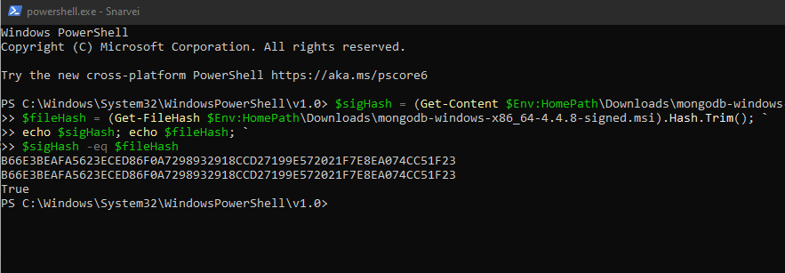
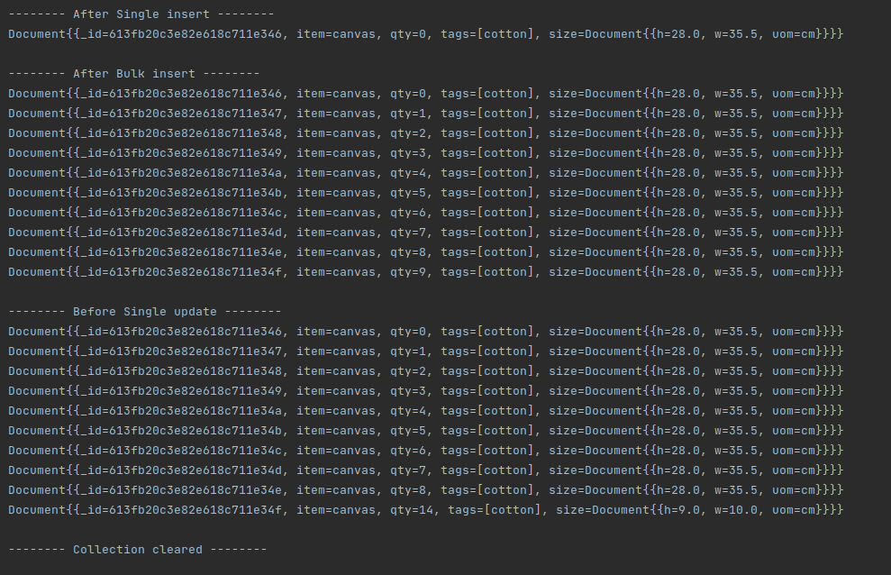

# DAT250: Software Technology Experiment Assignment 3
by Sindre Larsen

## Technical issues
No technical issues encountered during installation, setup or use of MongoDB.

I did validation on my desktop and the rest on my laptop, so the validation screenshot is from
Windows while the rest is Ubuntu.

Experiment 1 was also done with java and not in the mongo shell, [Source code here](https://github.com/SiLar92/expass3)

### Screenshots for:
The correct validation of the installation package

#### Relevant results obtained during Experiment 1 (it is not necessary to put a single screenshot on each substep, but at least one significant from each CRUD operation).
Relevant results Experiment 1:

Printout from performed CRUD operations, performed in the following order with query statements which shows the current contents of the collection:

insert single document -> bulk inserts -> update document -> delete all documents in collection

#### Experiment 2 example working and the additional Map-reduce operation (and its result) developed by each of you.

Experiment 2 example:

My implemented map-reduce operation ended up being an overview of earnings each date

----
No pending issues.