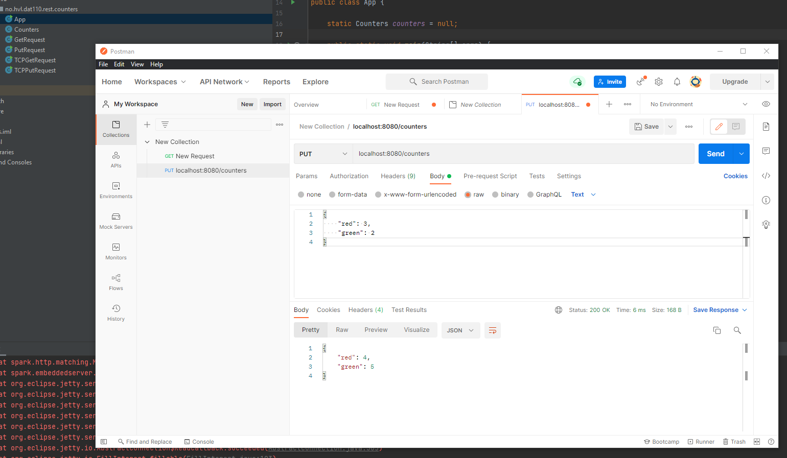
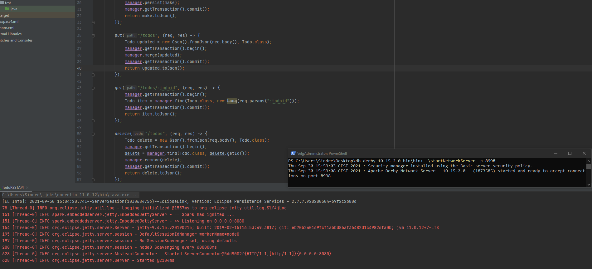
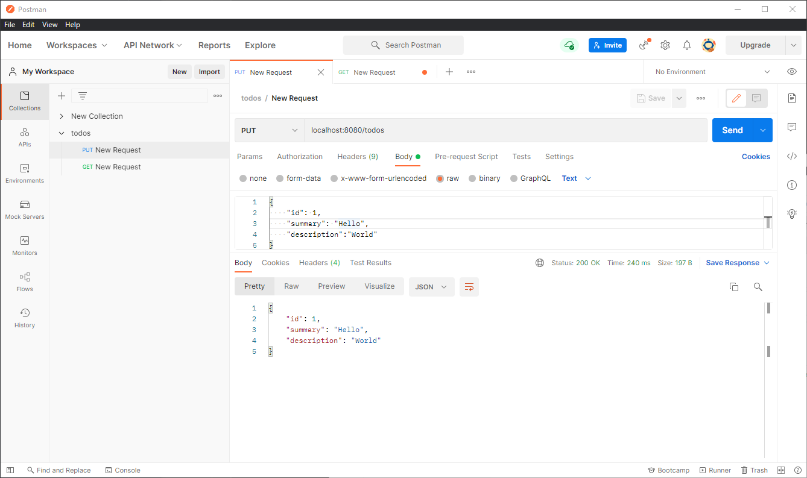
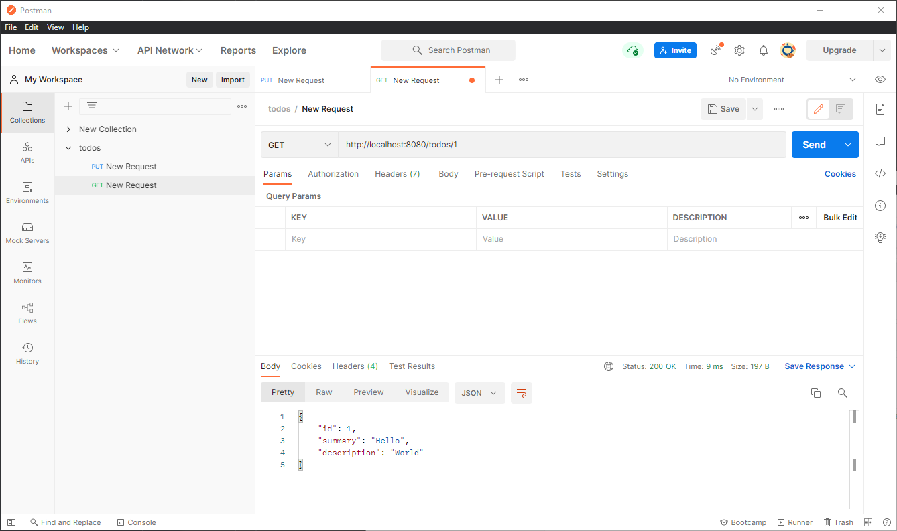

# DAT250: Software Technology Experiment Assignment 4
by Sindre Larsen

[Source code here](https://github.com/SiLar92/expass4)

## Technical issues
No technical issues encountered when completing the experiments.

## Experiment 1
Worked without issues

## Experiment 2
Took inspiration (and copied most of the pom.xml file) from Experiment 1's counter source code .

Hosted locally and used postmaster to access the database through the API.

Some examples showing the working implementation:

## Experiment 3 & 4

Looked at them and attempted some implementations, but did not get around to having any finished results to show here.

----
No pending issues.