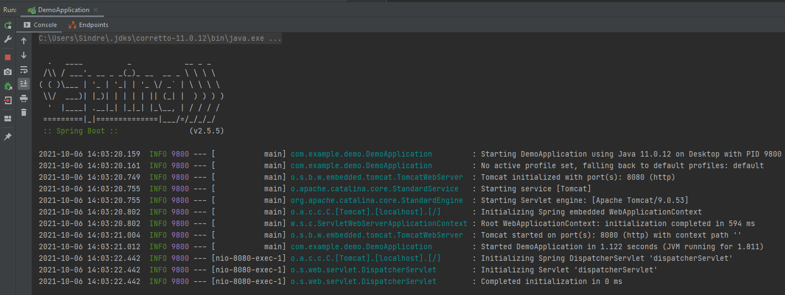
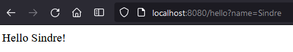
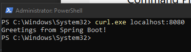
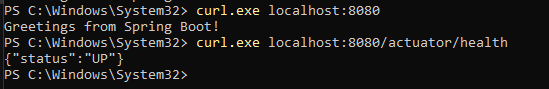
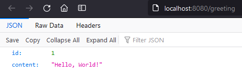
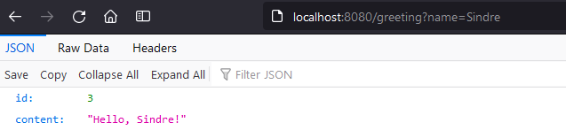
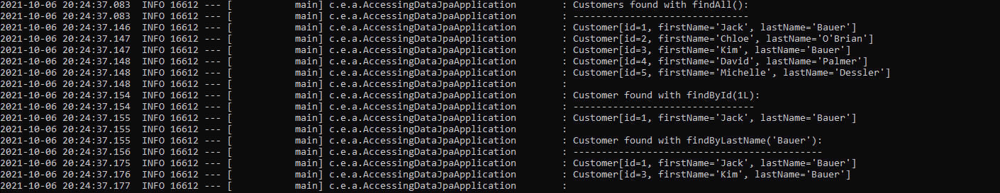

# DAT250: Software Technology Experiment Assignment 5
by Sindre Larsen

[Source code here](https://github.com/SiLar92/expass5)

## Technical issues
No technical issues encountered when completing the experiments.

## Experiment 1
Worked without issues, went through tutorial and got these results:

## Experiment 2
Worked without issues, went through tutorial and got these results:

Initial curl call when running through intelliJ

Also worked fine to run the application from commandline instead of through IntelliJ:

## Experiment 3
Worked without issues, went through tutorial and got these results:

## Experiment 4
Worked without issues, went through tutorial and got these results after building using maven in terminal.

----
No pending issues.