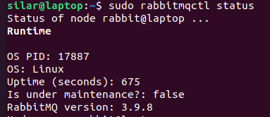
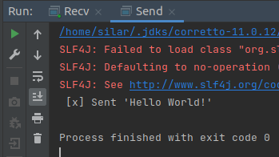
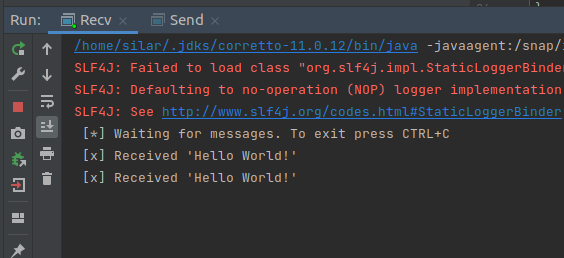
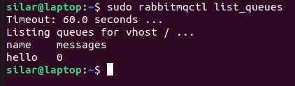
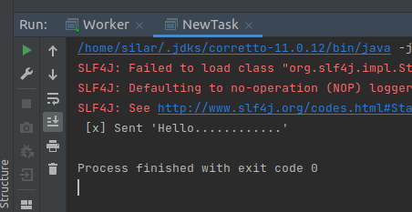
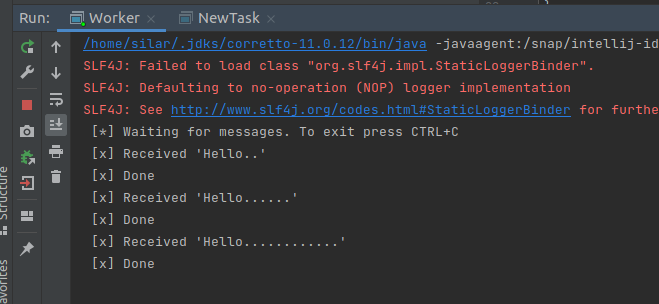
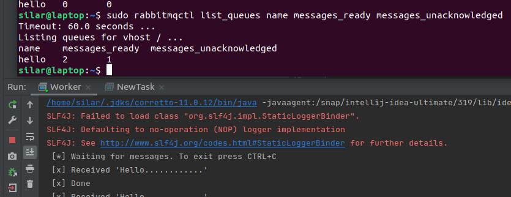
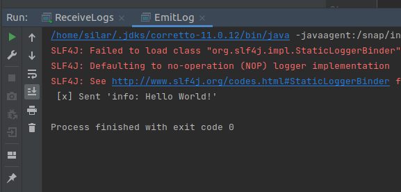
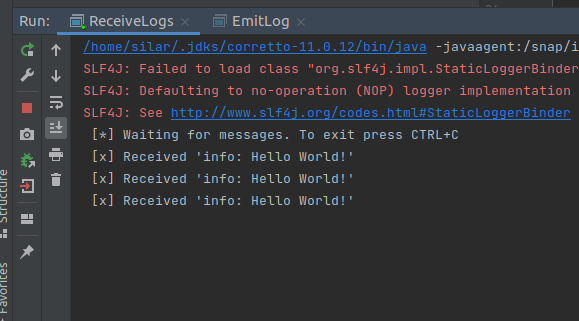
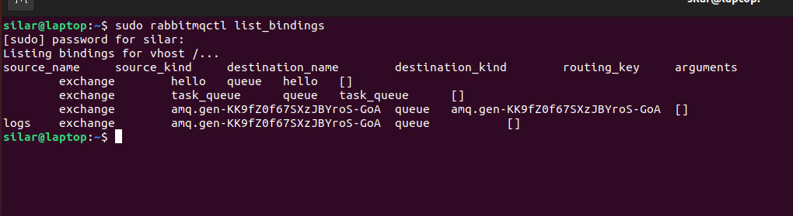

# DAT250: Software Technology Experiment Assignment 7
by Sindre Larsen

[Source code here](https://github.com/SiLar92/expass7)

## Technical issues
No technical issues encountered when completing the experiments.

## Experiment 1
No issues installing the software

## Experiment 2
Hello world tutorial:\

No issue sending or receiving \

Local queue\

## Experiment 3
Work queues tutorial:\
\
\

adding message acknowledgement we can see that messages are picked up, if the worker is interrupted.
The following screenshot is from worker running after being interrupted with messages in the queue.
\
where we see the worker immidiately starts working on the items in the queue. There were
no issues setting the messages to be durable or using fair dispatch.

## Experiment 4
Publish/subscribe tutorial went great without any issues.

 /
 /
 /

----
No pending issues.